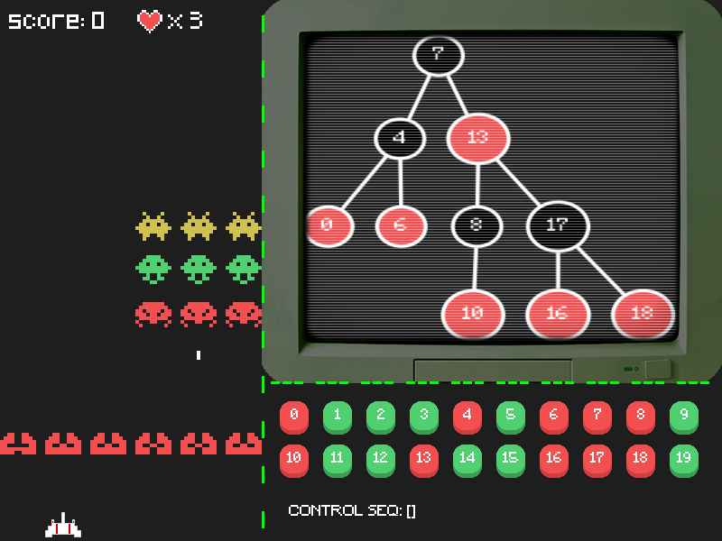

# RBTree-Invaders
+ 由太空侵略者和红黑树可视化生成器缝合的现代电子刑具！
+ Red/Black Tree Space Invaders game inspired by Space-invaders and Red black tree and tree visualization!

## Dependency
1. python >= 3.6
2. graphviz: https://graphviz.org/download/
3. pygame
4. 需要安装 ./fonts 文件夹下的两款字体

## 介绍
3202年，你驾驶的飞船受到太空海盗的袭击，船上的智能驾驶系统被破坏，你只好用船上的货物档案管理系统来操控飞船：

+ 点击屏幕右下角的按钮来给红黑树插入或删除数字；
+ 红黑树自平衡过程中，每发生一次左旋转，飞船就左移一格，每发生一次右旋转，飞船就右移一格；
+ 这就是全部的操作指南，用掌握到的红黑树知识击退海盗吧！

## To Do
+ 加入道具
+ 在线demo

## References
+ 游戏部分：clear-code-projects https://github.com/clear-code-projects/Space-invaders
+ 红黑树可视化部分：zhehaoli1999 https://github.com/zhehaoli1999/Red-black-tree-and-tree-visualization
+ 好看的按钮：clear-code-projects https://github.com/clear-code-projects/elevatedButton

## Lisence
This repository is of MIT lisence.

## Last but not least
If you find any bug, feel free to fix it and create pull request.
If you like it, click on the "star"! Thx.
